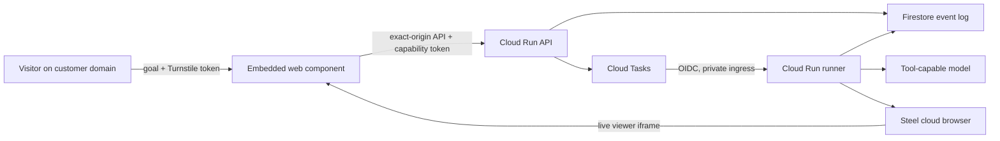

# Product AI Demo

A production-oriented, embeddable AI product-demo service. A visitor asks to see a workflow, a private runner opens the configured demo tenant in a Steel cloud browser, and the visitor watches the AI interact with it live inside the customer's website.

This repository intentionally contains the initial shippable product surface only: the embed SDK, public API, private runner, durable state, deployment infrastructure, tests, and operating documentation. It does not include a developer portal, billing UI, multi-region routing, voice, analytics dashboards, or human takeover.

## Architecture



The API and runner use one container image with separate entrypoints. Cloud Run scales both to zero; only the runner holds a browser and it is limited to one session per instance. See [architecture](docs/architecture.md) and [security](docs/security.md).

## Local setup

Requirements: Node.js 22+, a Google Cloud project with Firestore/Cloud Tasks credentials, Steel API access, and a tool-calling chat-completions model.

```bash
npm ci
cp .env.example .env
npm run check
PRODUCT_DEMO_API_URL=http://localhost:8080 npm run build
```

Run API and runner in separate terminals. End-to-end local runs require a Cloud Tasks-compatible queue or a manually invoked runner task; automated tests use in-memory fakes and never call paid providers.

```bash
npm run dev:api
PORT=8081 npm run dev:runner
```

Seed an integration from a reviewed JSON file:

```bash
npm run admin:seed -- config/integration.example.json
```

## Embed

Publish `packages/sdk/dist/product-demo.js` as an immutable, versioned asset. Generate its integrity value with `npm run sdk:sri`. The fastest integration attaches the SDK to the developer's existing demo button:

```html
<script
  src="https://cdn.example.com/product-demo/v1.0.0/product-demo.js"
  integrity="sha384-REPLACE_WITH_GENERATED_VALUE"
  crossorigin="anonymous"
  defer
></script>

<button id="see-demo">See a live AI demo</button>
<script>
  window.addEventListener("DOMContentLoaded", () => {
    const demo = new ProductDemo({ integrationId: "int_acme" });
    demo.mount("#see-demo");
  });
</script>
```

The npm package uses the same interface:

```ts
import ProductDemo from "@product/sdk";

const demo = new ProductDemo({ integrationId: "int_acme" });
demo.mount("#see-demo");
```

Most developers only need the constructor and `mount()`. See the [SDK guide](packages/sdk/README.md)
for optional controls, typed events, Turnstile, self-hosting, CSP, and error handling.

## Deploy

The supported initial deployment is one Google Cloud region. Cloud Run and Cloud Tasks are inexpensive at low traffic because the services have zero minimum instances; Steel and model usage remain the variable per-demo costs.

Follow the exact sequence in [deployment](docs/deployment.md), then use [runbook](docs/runbook.md) for alarms, incident handling, and recovery.

Release approval is governed by the [production readiness contract](docs/production-readiness.md); passing unit tests alone is intentionally insufficient.

## Commands

- `npm run check` — typecheck, lint, and test
- `PRODUCT_DEMO_API_URL=https://api.example.com npm run build` — compile the server and build an SDK pinned to that API
- `npm run sdk:smoke` — verify the exact CDN global and ESM default-export formats
- `npm run sdk:sri` — print the embed's SHA-384 SRI value
- `npm run admin:seed -- file.json` — create or update an integration

## Security boundary

This system must run only against a dedicated demo tenant containing synthetic data. The runner accepts feature IDs, ephemeral inspected element references, and preconfigured fixture keys—not arbitrary URLs, selectors, credentials, shell commands, or model-generated text input. A model is not a security boundary; validation and allowlists are enforced in code.

Permitted controls must opt in with `data-ai-demo-action="action_id"`, and that ID must be listed in `allowedActionIds`. Fixture inputs must declare `data-ai-demo-input="fixture_key"`. Unmarked controls are denied by default.
