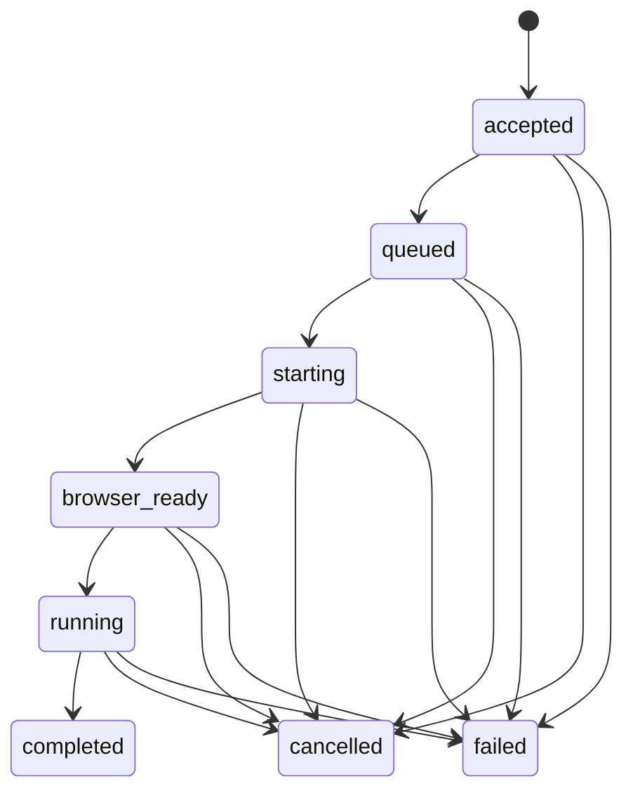

# Architecture and lifecycle

## Services

`@product/sdk` exposes one dependency-free `ProductDemo` client. Its internal custom element is isolated by a closed Shadow DOM and is not part of the public integration surface. It never receives a Steel API key, model key, HMAC secret, or customer credentials. Its session capability stays in memory and is sent only in the `Authorization` header.

`@product/server` has two entrypoints. `api.ts` is the internet-facing control plane. `runner.ts` is private and invokable only by Cloud Tasks through Cloud Run IAM. Both use Firestore as the durable source of truth.

The runner creates a Steel session and connects over CDP with Playwright. Steel's `sessionViewerUrl` is returned through the authenticated view endpoint and rendered as an iframe inside the host page. The product browser is therefore visible; it is not a headless-only experience.

Each controlled document receives a presentation-only branded cursor before product scripts run. It is rendered in a closed Shadow DOM inside the Steel browser, so it is part of the WebRTC stream rather than a coordinate approximation over the embed iframe. Authorized click and fixture-input tools first move Playwright's mouse to the target, allow the cursor transition to settle, and only then perform the action. The overlay is visible while idle, pulses on clicks, and remounts after page code removes it; a new document receives a fresh overlay through Playwright's init script.

## Session lifecycle

Session creation is idempotent. The session ID and capability are deterministically derived from the integration and a high-entropy idempotency key, while only their hashes are stored. Admission, the initial event, and the per-integration capacity counter commit in one Firestore transaction. Terminal state, its event, and capacity release also commit atomically. A task retry claims a time-limited Firestore lease; a second worker cannot run the same active session.

Every visitor message, lifecycle change, provider request, narration, and tool outcome is an ordered, versioned event. A tool call and its started event commit atomically before browser side effects; settlement and its result event also commit together. On lease recovery, unfinished calls become `interrupted` and any previous Steel session is released before replacement. This makes interrupted work diagnosable without silently replaying an ambiguous action.

## Agent harness

The outer workflow—load configuration, claim, create browser, open start page, run bounded loop, finalize, release—is deterministic code. The model can choose exactly one typed tool per turn. All tools are sequential and have bounded output, timeout, and arguments.

The runner checks cancellation between turns, incorporates ordered visitor steering messages, heartbeats its lease, stops at the configured duration/step count, and terminates after repeated identical actions. Model-visible context is capped independently from the durable full history, completion tokens are capped, and transient provider requests use bounded retries. Steel receives a millisecond session timeout, and a scheduled sweeper expires stale records and releases browsers, so cleanup does not depend solely on a healthy runner process.

## Capacity

Cloud Tasks is the admission buffer. Runner concurrency is one, runner maximum instances controls browser concurrency, and each integration has its own active-session cap. The API returns `429` rather than creating work beyond an integration's limit.
